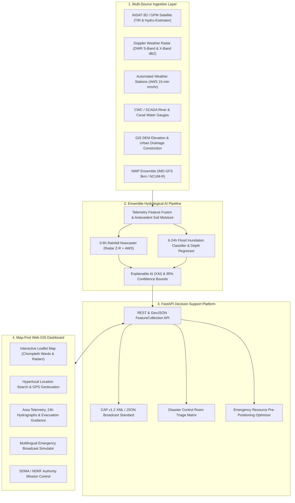

# AquaAlert AI (Smart India Hackathon 2026 - SIH26071)
### Integrated Heavy Rainfall Early Warning & Hyperlocal Flood Inundation Prediction System
**Theme**: Disaster Management / Climate Resilience  
**Target Pilot Basin**: Mumbai Metropolitan Region (Mithi River Catchment & Lowland Coastal Wards) & Scalable Nationwide

---

## 🌊 Executive Summary & Problem Context
Traditional meteorological warnings issued by state authorities are broad and city-wide (e.g. *"Heavy rain warning for Mumbai / Chennai District"*). This leads to:
1. **Severe Alert Fatigue**: 80% of elevated urban areas remain completely dry while alerts are blaring.
2. **Delayed Response**: Disaster management forces (NDRF / SDRF) lack spatial precision regarding exactly which roads, underpasses, and vulnerable slum settlements will submerge and when.
3. **No Early Inundation Lead Time**: Rainfall forecasts do not translate into actual flood water depth (cm) or river stage overflow.

**AquaAlert AI** solves this by fusing **6 heterogeneous telemetry layers** into a physics-guided AI/ML pipeline to generate **hyperlocal (ward/grid level) warnings**:
- **0–6 Hour Rainfall Nowcast** (mm/hr convective cell tracking)
- **6–24 Hour Inundation Risk & Water Depth Prediction** (cm)
- **Explainable AI (XAI)** driving factor attribution
- **Actionable Decision Support** with model uncertainty bounds ($\pm$ margin)
- **Common Alerting Protocol (CAP v1.2 / ITU-T X.1303)** inter-agency export
- **Multilingual Emergency Alerts** (English, Hindi, Marathi, Tamil, Bengali, Telugu)

---

## 🏗️ System Architecture



---

## 🔬 Mathematical Modeling & Hydrometeorological Fusion

### 1. Radar Reflectivity to Precipitation Rate (Marshall-Palmer Empirical Relation)
$$Z = a \cdot R^b \implies R = \left(\frac{10^{Z_{\text{dBZ}}/10}}{200}\right)^{\frac{1}{1.6}}$$
Where $Z$ is radar reflectivity factor ($\text{mm}^6/\text{m}^3$) and $R$ is instantaneous precipitation rate ($\text{mm/hr}$).

### 2. Antecedent Precipitation Index (API) & Soil Moisture Memory
Soil infiltration capacity decreases exponentially as soil becomes saturated:
$$API_t = \sum_{i=1}^{k} C^i P_{t-i}$$
Where $C \approx 0.85 - 0.92$ is the soil recession constant and $P_{t-i}$ is historical daily rainfall.

### 3. Urban Inundation Hydrodynamic Proxy
$$Q_{\text{peak}} = C \cdot I \cdot A$$
$$\text{Water Depth} \propto f\left(Q_{\text{peak}}, \text{River Stage Ratio} \left(\frac{H_{\text{river}}}{H_{\text{danger}}}\right), \text{DEM Elevation}, \text{Drainage Constriction}, \text{Tidal Surge}\right)$$

---

## 🚀 Key Features

| Feature | Description |
|---|---|
| **Hyperlocal Map Dashboard** | High-contrast GIS map showing color-coded risk zones (Green: Low, Yellow: Moderate, Orange: High, Red: Severe) at ward/polygon level. |
| **Area Search & Geolocation** | Search any locality or click *"Use My Location"* to instantly diagnose your flood risk. |
| **Deep-Dive Hydrographs** | 24-hr projected precipitation and water depth curves with confidence intervals. |
| **Explainable AI (XAI)** | Transparent breakdown of top risk drivers (e.g. *"Heavy 3-hr rain (+38%)"*, *"Mithi river stage at 94% of danger mark (+27%)"*). |
| **Multilingual Warnings** | Real-time warnings translated into English, Hindi (हिंदी), Marathi (मराठी), Tamil (தமிழ்), Bengali (বাংলা), Telugu (తెలుగు). |
| **Mock Broadcast Simulator** | Live preview of government Emergency Cell Broadcast alarm, WhatsApp flash alert, and SMS text. |
| **SDMA / NDRF Control Room** | Authority view with prioritized triage ranking, dewatering pump & boat dispatching, and human-in-the-loop alert verification. |
| **Crisis Scenario Simulator** | Instant switching between *"Monsoon Cloudburst"*, *"Cyclone Tidal Surge"*, *"Normal Monsoon"*, and *"Baseline Dry"*. |
| **CAP v1.2 Protocol Export** | Official XML format conforming to ITU-T X.1303 for integration into NDMA SACHET. |

---

## 🛠️ Quickstart: Running Locally

### Prerequisites
- Python 3.10+ (Python 3.14 supported)
- Node.js 18+ and npm

### 1. Start Backend Server
```bash
# In project root:
cd backend
python main.py
# Or run with uvicorn:
python -m uvicorn backend.main:app --host 127.0.0.1 --port 8000 --reload
```
API Documentation will be live at: `http://localhost:8000/docs`

### 2. Start Frontend App
```bash
cd frontend
npm install
npm run dev
```
Open your browser at: `http://localhost:5173`

---

## 🐳 Docker Deployment
```bash
docker-compose up --build
```
- Frontend: `http://localhost:5173`
- Backend API: `http://localhost:8000`
- API Docs: `http://localhost:8000/docs`
